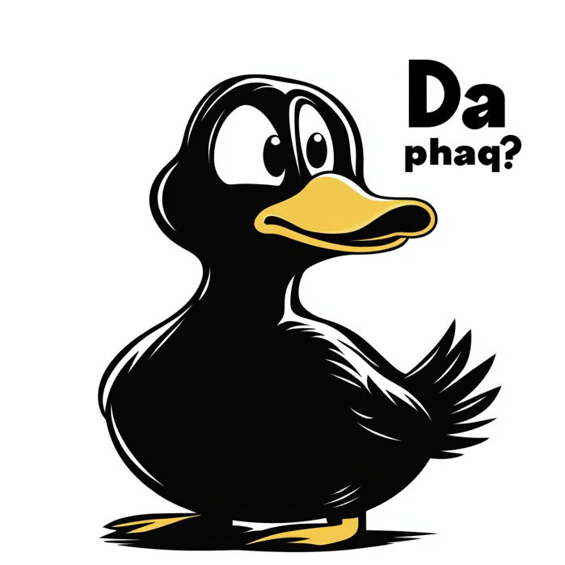

# Da phaq?

A Chrome extension to explain confusing stuff.

## Easy Installation
1. Open Chrome 
2. `chrome://extensions/`
3. Search for Da phaq?
4. Install

## Source Code Installation

1. Clone this repository or download the source code
2. Open Chrome and navigate to `chrome://extensions/`
3. Enable "Developer mode" in the top right corner
4. Click "Load unpacked" and select the extension directory

## Usage

1. The first time you use Da phaq? you'll be asked for your [OpenAI API key](https://platform.openai.com/api-keys)
2. Go to any webpage
3. Select text and open the extension

## Things you might like to know

1. This extension stores your OpenAI API key in Chrome's local storage.
2. Text is sent between your browser and OpenAI. Nowwhere else. 
3. Da Phaq? uses OpenAI's gpt-4o-mini model. It's quick and cheap. 
4. It doesn't work with PDFs or images (sorry)

## Development

To modify or enhance the extension:

1. Clone the repository
2. Make your changes
3. Reload the extension in Chrome
4. Test your changes

## Contributing

Contributions are welcome! Please feel free to submit a Pull Request.

## License

This project is licensed under the MIT License - see the LICENSE file for details. 